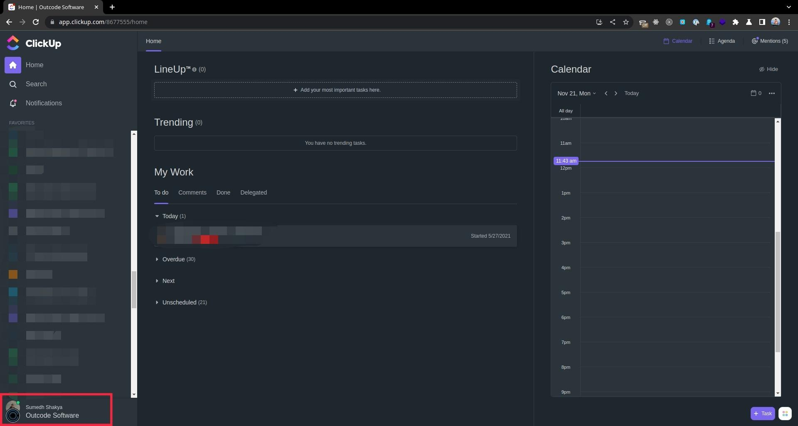
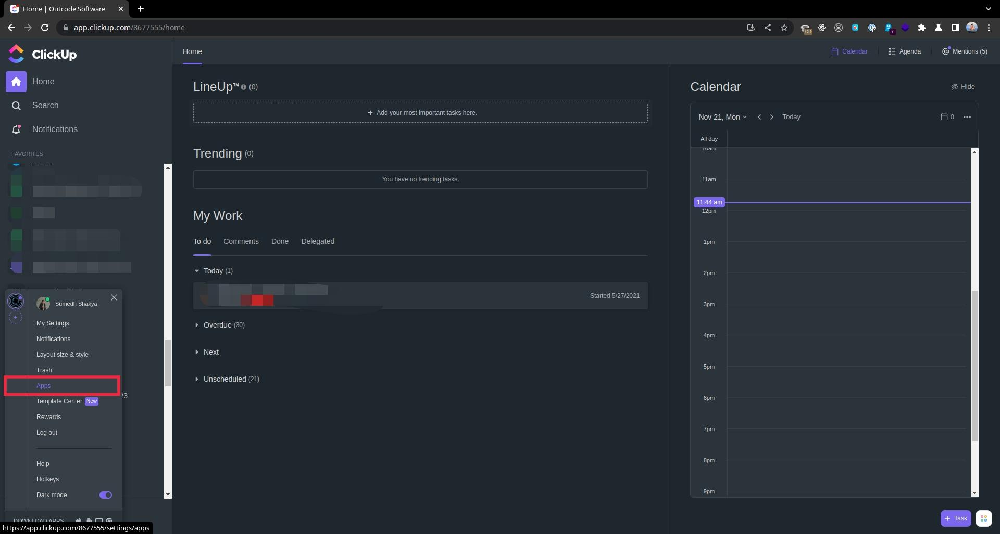
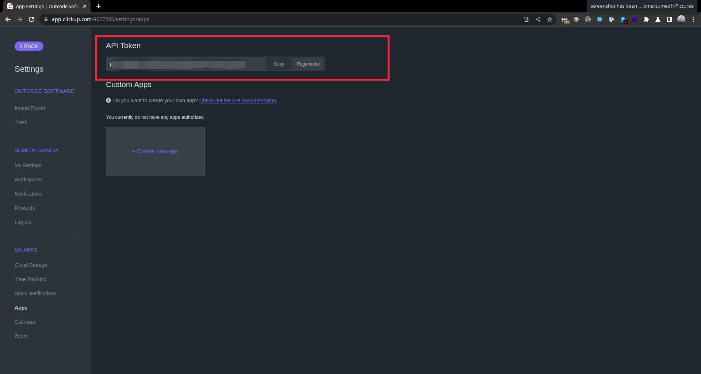
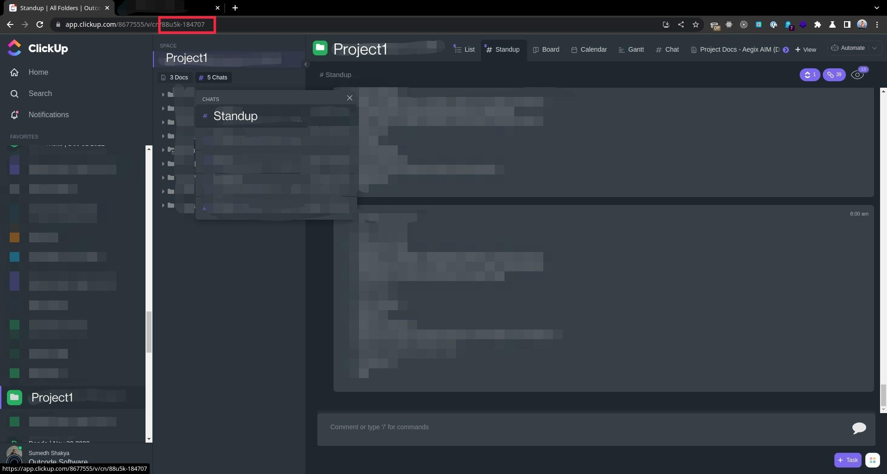

# git-commit-publish
Bash scripts to log daily commit into a file and publish as standup to clickup.

---

## commit
`commit` script formatizes your commit message by prepending your current branch name with your work tag to your commit message.
Additionally, it will log your daily commit message into a file at directory `$HOME/work_log/TODAY_DATE.log` only if git commit is successful.

### How to use
- Copy commit to /usr/local/bin folder (might need to use sudo )
```
cp commit /usr/local/bin/commit
chmod +x /usr/local/bin/commit
```
- Go to your project directory
- Stage your changes
```
git add .
```
- Commit your changes
```
commit -t <Tag> -m <Your Commit Message>
```

For command help,
```
commit -h
```

You will then see your commit message logs in `$HOME/work_log` directory

---

## publish
`publish` script adds your work update from your day commit message to Clickup Project Chats.

### How to setup
- Log in to clickup
- Clickup on your profile (Bottom-Left of page).

- Clickup on Apps

- Re/Generate API token and Copy it.


- Add API token to your system's environment variable permanently.
    - If you are using bash as default shell
    ```
    echo "export CLICKUP_API_KEY=<API KEY>" >> ~/.bashrc && source ~/.bashrc
    ```

    - If your are using zsh as default shell
    ```
    echo "export CLICKUP_API_KEY=<API KEY>" >> ~/.zshrc && source ~/.zshrc
    ```

- Go to your project space and find view_id of it.


- Add View ID of your project space to system environtment variable.
    - If you are using bash as default shell
    ```
    echo "export CLICKUP_VIEW_ID=<View ID>" >> ~/.bashrc && source ~/.bashrc
    ```

    - If your are using zsh as default shell
    ```
    echo "export CLICKUP_VIEW_ID=<View ID>" >> ~/.zshrc && source ~/.zshrc
    ```

### How to use
- Copy commit to /usr/local/bin folder (might need to use sudo )
```
cp publish /usr/local/bin/publish
chmod +x /usr/local/bin/publish
```
- Publish your work update to Clickup
```
publish
```
